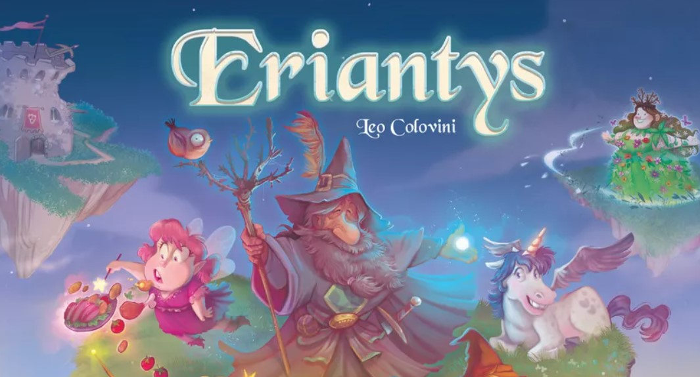

# Ingsw2022-AM35


Implementation of the Game [Eriantys](https://www.craniocreations.it/prodotto/eriantys/)

Rules of the Game can be found [here](https://www.craniocreations.it/wp-content/uploads/2021/11/Eriantys_ITA_bassa.pdf)

# Description
## Overview
This project, part of the Software Engineering course at Polytechnic of Milan, involved implementing the board game Eriantys in Java, featuring both GUI and CLI. It supports multiplayer gameplay, adheres to official rules, and implements all game functionalities.

## Process
The development began with UML-based architecture design, refined during implementation. Using JavaFX for the GUI, JUnit for testing, and Maven for build management, the project, following the Model-View-Controller pattern, ensures modularity and robust testing, achieving near-complete code coverage. A custom communication protocol supports socket-based multiplayer functionality

## Outcome
The final implementation delivers a fully functional game with GUI, CLI, and multiplayer features. A single executable JAR ensures easy deployment, highlighting strong design, testing, and implementation skills.


# Project Gallery


# Documents

### UML
These two diagrams describes how the project was initially thought
and the last implementation of the project, modified to overcome some critical issues
during the development

- [Early UML](Deliveries/Final%20UML/Model_Uml.png)
- [Latest UML](Deliveries/Final%20UML/ingsw_final_uml.png)

### Coverage Quick view
| Package        | Class Coverage | Method Coverage | Line Coverage |
|----------------|----------------|-----------------|---------------|
| __Model__      | 100 %          | 91 %            | 90 %          |
| __Controller__ | 100 %          | 98 %            | 79 %          |


### Javadoc

- [Here](Deliveries/Javadoc) can be found all the documentation about most of the project,
includes classes and methods used

### Plugins and libraries
| Plugin/Library| Description                                             |
|----------------|---------------------------------------------------------|
| __Maven__      | Software project management and comprehension tool      |
| __JavaFx__     | Graphics library used to create graphic user interfaces |
| __JUnit__      | Unit Testing Framework                                  |

### Communication protocol

- [Communication Protocol](Deliveries/Communication_Protocol.jpg)

### Peer review

- [Peer Review UML](Deliveries/Peer-Review_AM08.pdf)
- [Peer Review Communication Protocol](Deliveries/PeerReview_AM08.docx)

### Implemented functionalities

| Functionality     | State  |
|:------------------|:------:|
| Basic rules       |   🟢   |
| Complete rules    |   🟢   |
| Socket            |   🟢   |
| GUI               |   🟢   |
| CLI               |   🟢   |
| Multiple games    |   🟢   |
| 4 Player basicMatch    |   🟢   |
| 12 Character Card            |   🟢   |

## Eriantys: How to start

### Compiling

There will be only one jar either for server, CLI or GUI

- [Here](Deliveries/Jar) can be found the pre-compiled jar

Or if you want to create your own jar executable you have to get on 
the path of your project and use the command:
```
mvn clean package
```
This jar will be found in the ```target/``` folder with the name```AM35-Eriantys.jar``` 

### Execution 

To launch the executable digit the command:
```
java -jar AM35-Eriantys.jar
```
You can launch either server or the user interfaces by digit the command:
- ```server```
- ```-cli```
- ```-gui```

### Utilities
The port where the server works is 1234

### Students:

[Camilla Andiloro](https://github.com/camillaandiloro)   
[Emanuele Cimino](https://github.com/emacimino)   
[Marco Crisafulli](https://github.com/MarcoCrisafulli)  


